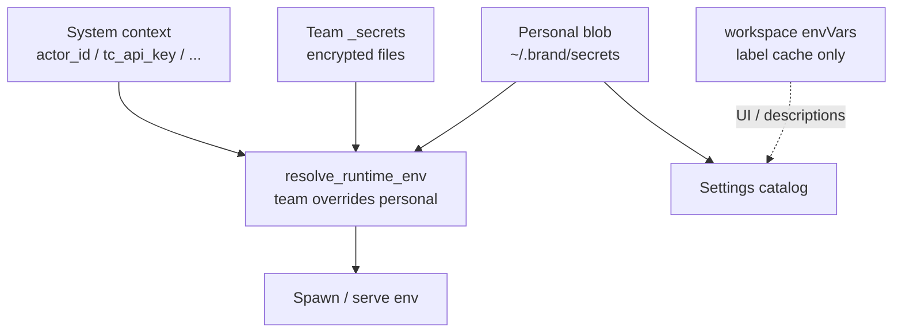

# 个人变量与运行时环境变量加载

> 状态：现行实现说明（2026-08）。产品规则：**个人变量 = 整机全局（按品牌）**，
> workspace `envVars` 只是标签缓存，不是 allowlist，也不参与注入过滤。

本文说明 TeamClu / Copilot 361 等品牌下，个人变量如何存储、如何进入 agent
runtime，以及设置页诊断各字段的含义。实现主要落在
`crates/teamclu-runtime-env/`、`apps/desktop/src/commands/env_vars.rs`、
`apps/daemon/src/runtime/env_assembly.rs`。

---

## 1. 三层变量

Agent 最终拿到的环境是三层合并结果（后层覆盖前层同名 key）：

| 层 | 含义 | 典型来源 |
|---|---|---|
| **Personal** | 本机用户配置的密钥 / URL | `~/.{brand}/secrets/personal-secrets.json.enc` |
| **Team** | 团队共享加密密钥 | `{team}/_secrets/*.enc.json`（经 team secret 解密） |
| **System** | 运行时派生 | `actor_id`、`tc_api_key`、`display_name`、`TC_ACCESS_TOKEN_FILE` 等 |

合并入口：`teamclu_runtime_env::resolve_runtime_env` →
`assemble_runtime_env` → daemon `assemble_spawn_runtime_env` → 各 backend
spawn / `opencode serve` 的 env snapshot。



优先级口诀：**System / Team 覆盖 Personal；Host OS 环境可再挡住注入（host shadowed）**。

---

## 2. 个人变量：值与索引分离

个人变量拆成两层存储，职责不同：

| 层 | 路径（示例） | 作用域 | 内容 |
|---|---|---|---|
| **加密 blob（真相）** | `~/.teamclu/secrets/` 或 `~/.copilot361/secrets/` | **整机、按品牌** | key → 明文值（AES-GCM） |
| **索引缓存** | `{workspace}/.teamclu/teamclu.json` → `envVars`（白标为 `.copilot361/copilot361.json`） | **每个 workspace** | key + description / category，**无 secret** |

### 2.1 品牌与存储目录

| `APP_SHORT_NAME` | Home secrets 目录 |
|---|---|
| `teamclu` / `teamcludev` | `~/.teamclu/secrets` |
| `copilot361`、`betly` 等白标 | `~/.{shortName}/secrets` |

解析函数：`resolve_storage_dir_name`（官方品牌统一落到 `teamclu`）。

Desktop 启动 managed amuxd 时设置：

```text
TEAMCLU_BRAND_SHORT_NAME=<APP_SHORT_NAME>
```

Daemon 侧 `load_personal_env()` / `diagnose_personal_env_store()` 读取该 env
（缺省 `teamclu`），从而与桌面读写同一份 blob。未设置时白标会误读
`~/.teamclu`——这是历史 bug，现已靠该 env 修复。

### 2.2 Blob 内特殊 key

| Key 模式 | 用途 | 是否算「用户个人变量」 |
|---|---|---|
| 普通 string key（如 `ANTHROPIC_AUTH_TOKEN`） | 用户/产品配置 | 是 |
| `tc_api_key` | 系统派生 / 本地缓存 | 否（internal） |
| `_team_secret.{teamId}` | 本机保存的团队解密密钥 | 否（internal） |
| `_git_credential.*`（JSON 对象） | Git 凭证桥 | 不进入 string env 注入 |

### 2.3 写入路径

设置页 / introspect `env_catalog_set`（scope=`personal`）：

1. 写入加密 blob（全局）
2. 更新**当前** workspace 的 `envVars` 索引缓存

因此：**值立刻对所有 workspace 可见（下次注入）**；索引只保证「写过的那个
workspace」立刻对齐。其它 workspace 靠打开时派生（见 §4）。

### 2.4 读取 / 注入路径

Daemon 组装 spawn env 时：

1. `load_personal_env()` → **整份** blob（不按 workspace 过滤）
2. 加载 team env
3. `resolve_runtime_env` 合并 + 生成 uppercase / 去点 alias
4. 物化 `opencode.json` 的 `provider.team` 等
5. 交给 workspace 对应的 `opencode serve` generation / 其它 runtime；env 在
   **spawn 时冻结**

**Workspace `envVars` 不参与注入过滤。** 索引缺失不会阻止 blob 里的值进入
agent（只要 daemon 读对了 brand 路径，且完成 reload / 新 session）。

amuxd 不再用一个 device-wide serve snapshot 服务所有 workspace。它持有有界
OpenCode host pool：每个 workspace isolation domain 有一个 current generation，
workspace root 与 worktree 仍由 `directory` query 在该 domain 内区分。环境修订
变化时启动新 generation；已有 session 固定在旧 generation 上直至 detach，不会
在 live session 中原地修改环境。

容量策略是 idle TTL **300 秒（5 分钟）**、soft limit **2**、hard limit **3**。
达到 hard limit 时新 acquire 按 FIFO 等待可用容量；active/draining generation
不会被容量回收。

---

## 3. 设置页 Catalog

`env_catalog_list` → `load_personal_env_listings(workspace, brand)`：

1. 读 workspace 索引（description / category / `tc_api_key` 等系统行）
2. 合并该 brand 下 blob 的用户 key（缺索引也显示）
3. 再合并团队 `_secrets` 列表（team scope）

因此多 workspace 下，设置页应能看到本机所有个人 key，而不仅是当前
workspace 曾保存过的索引。

Agent 工具侧的 `load_agent_env_listings` 使用同一套 personal 合并逻辑。

---

## 4. Workspace bind：派生索引缓存

`register_window_workspace` 时依次：

1. `ensure_system_env_vars` — 系统 key（如 `tc_api_key`）写入 blob + 索引
2. `derive_personal_env_index_from_blob` — 把 blob 里尚不在索引中的**用户**
   key 以 key-only 形式补进当前 workspace `envVars`（不写 secret）

效果：从「只在 A 项目配过」切到「B 项目」时，B 的索引会被补齐，诊断不再
长期显示「Blob not indexed」。索引仍只是缓存，不是权限边界。

---

## 5. 团队变量（简要）

- 密文文件：团队共享目录下 `_secrets/*.enc.json`
- 解密密钥：`team.envSecret`（workspace 配置）或 blob 中的
  `_team_secret.{teamId}`（desktop / daemon 均走 brand-aware 路径）
- 加载：`apps/daemon/src/team_shared_env.rs`
- 与 personal 同名时：**team 覆盖 personal**

团队变量的同步 / KMS 细节见 shared-secrets / team-share 相关文档；本文只
强调它在合并层的位置。

---

## 6. 诊断（Personal env activation）

设置页「个人变量生效诊断」聚合：

| 检查 | 数据来源 | 说明 |
|---|---|---|
| Local encrypted store | Desktop `personal_env_diagnostics` | 路径、blob 是否可读 |
| User vars / indexed entries | blob 用户数 vs workspace 索引用户数 | 可不一致；仅缓存漂移 |
| Index vs blob alignment | 两边 key 差集 | **不再作为 BLOCKED**；为 degraded / 信息 |
| Daemon user personal var load | amuxd 读到的个人变量数 | 应与 brand blob 一致 |
| Resolved scopes | personal / team / system 计数 | 合并后层数 |
| Environment revision / generation | requested vs workspace current generation | pending/starting → 需 Reload 或等待 rolling replacement |
| Per-key injection | active / pending / host_shadowed … | pending 通常要 reload + 新 session |
| Unresolved opencode placeholders | `opencode.json` 里 `${KEY}` | 缺 key 时 MCP/provider 可能失败 |
| Host environment override | 进程环境与 personal 同名 | amuxd 进程 env 会挡住注入 |

### 整体状态（前端 rollup）

`computeEnvActivationOverallStatus`：

- **blocked**：blob 不可读、daemon critical blocker、未保存的 dirty keys 等
- **degraded**：索引缓存漂移、active runtime、snapshot pending、host shadow 等
- **healthy**：存储可读、快照对齐、无待处理注入

索引与 blob 不一致 → **degraded**，不是 blocked（个人值以 blob 为准）。

---

## 7. 生效时机与常见操作

| 现象 | 原因 | 处理 |
|---|---|---|
| 改了变量但 agent 仍用旧值 | env 在 generation spawn 时注入；旧 session 固定在旧 generation | **Reload agent runtime**，再开**新 session** |
| 诊断显示 pending/starting · revision 不一致 | 当前 workspace 正在请求或启动新 generation | 等待 rolling replacement；active 旧 session 可继续完成 |
| 白标读不到个人变量 | amuxd 未带 `TEAMCLU_BRAND_SHORT_NAME` | 确认桌面 managed spawn 路径；重启桌面 |
| Host shadowed | 启动 amuxd 的 shell 里已有同名 env | 从启动环境 unset，或换 TeamClu key 名 |
| `opencode.json` 仍显示 `${QWEN_API_KEY}` | blob/team 都没有该 key | 在设置里配置，或去掉 MCP 引用 |

---

## 8. 关键代码索引

| 模块 | 路径 |
|---|---|
| Brand / 存储命名空间 | `crates/teamclu-runtime-env/src/storage_namespace.rs` |
| 个人 blob 加解密 | `crates/teamclu-runtime-env/src/personal_secrets.rs` |
| Catalog / listings | `crates/teamclu-runtime-env/src/env_catalog.rs` |
| 三层合并 | `crates/teamclu-runtime-env/src/resolved_env.rs` |
| 组装入口 | `crates/teamclu-runtime-env/src/lib.rs`（`assemble_runtime_env`） |
| Desktop 读写 / 派生索引 | `apps/desktop/src/commands/env_vars.rs` |
| Desktop 本地加密存储 | `apps/desktop/src/commands/local_secret_store.rs` |
| Workspace bind | `apps/desktop/src/commands/window.rs` |
| amuxd brand env | `apps/desktop/src/commands/amuxd_supervisor.rs` |
| Daemon spawn 组装 | `apps/daemon/src/runtime/env_assembly.rs` |
| Host pool / generation | `apps/daemon/src/runtime/opencode_http/host_pool.rs` |
| 激活诊断 | `apps/daemon/src/runtime/supervisor.rs`（`env_activation_diagnostics`） |
| 前端状态 rollup | `packages/app/src/lib/diagnostics/env-diagnostics.ts` |
| 设置页 UI | `packages/app/src/components/settings/EnvVarsSection.tsx` |

---

## 9. 明确不做（当前产品边界）

- **不做**「按 workspace 启用个人变量」的 allowlist（方案 B）。
- **本机多品牌 daemon 状态目录**：官方 `~/.amuxd`，白标 `~/.amuxd-<brand>`（见
  [`multi-brand-local-daemon.md`](./multi-brand-local-daemon.md)）。Desktop spawn
  同时设置 `TEAMCLU_BRAND_SHORT_NAME` 与 `AMUXD_HOME`。
- Workspace `envVars` **不会**被提交为密钥源；勿把 secret 写进该 JSON。

---

## 10. 一句话总结

**个人变量的值在 `~/.{brand}/secrets`，整机共享；workspace 的 `envVars` 只是
标签缓存；amuxd 用 `TEAMCLU_BRAND_SHORT_NAME` 读对目录；注入用整份 blob，
改完后 Reload runtime 会滚动当前 workspace 的 generation，新 session 才使用新
环境；其它 workspace 不受影响。**
