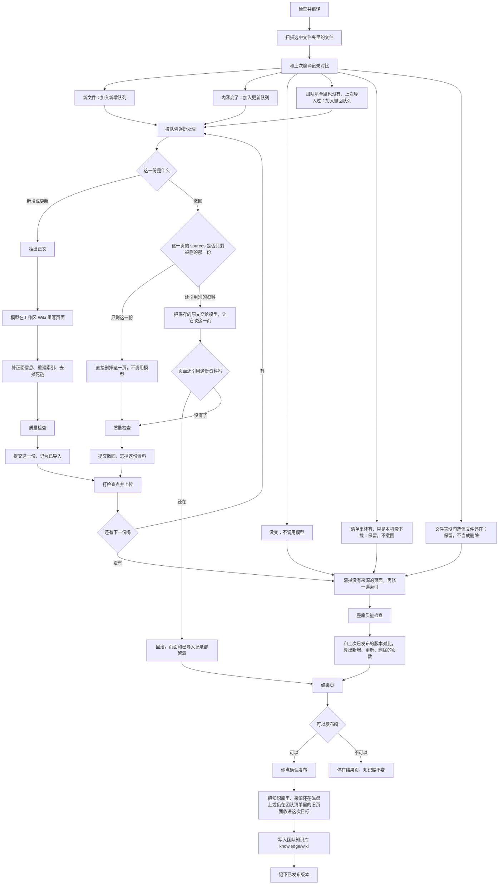
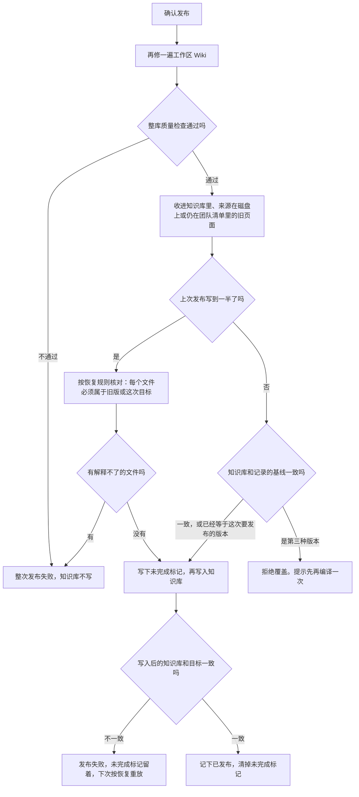

# Wiki 编译过程与报错处理

- **Date**: 2026-09-24
- **Status**: 描述当前实现。Desktop「维护 Wiki」走 `scripts/kb-maintainer/desktop-runner.js` 的 `prepare`，确认发布走同一文件的 `publish`。
- **Related**: [2026-09-20-llm-wiki-maintainer-p0-design.md](./2026-09-20-llm-wiki-maintainer-p0-design.md)

编译发生在本机工作区。资料在团队的 `documents/`，模型改的是工作区里的 Wiki，点「确认发布」之后才写入团队知识库 `knowledge/wiki`。一份资料失败只回滚这一份，已经成功的留下，然后继续下一份。

三处目录：

| 角色 | 位置 |
| --- | --- |
| 资料 | `~/.amuxd/teams/<teamId>/shared/team-sync/documents` |
| 工作区 Wiki | 系统配置目录下的 `teamclu/kb-maintainer/<teamId>/wiki`（macOS 为 `~/Library/Application Support/teamclu/kb-maintainer/<teamId>/wiki`） |
| 团队知识库 | `~/.amuxd/teams/<teamId>/shared/team-sync/knowledge/wiki` |

`documents/` 根目录上的散落文件不是来源。来源必须是 `documents/<文件夹>/`。

## 1. 正常流程



可以发布要同时满足四件事：选中的文件夹里有资料或有要撤回的资料、整库质量检查通过、页面有增删改、这次没有撤回失败。新增或更新失败不会挡住已经成功的页面。撤回失败会挡住发布，因为那一页还在。结果页提示「先看这次的结果，再确认发布。确认前不会写入知识库。」

「已撤回 N 个」只数撤回成功的份数。计划里有、但失败的那份不算。

队列来自 `dry-run.js` 和 `reconcile.js`。逐份处理在 `ingest.js` 的 `ingestBatch`：新增和更新走 `ingestOne`，撤回走 `retractOne`。模型调用走本机 daemon 已有的会话：`daemon-session.js` 用 `~/.amuxd/run` 里的端口和令牌换会话，把你选的模型 id 设上去，再把文字和图片发给这个会话。会话开在 Agent 已有的默认项目里，不开在维护 Wiki 目录上。模型只回复页面内容，脚本再写入 Wiki。daemon 没启动、或没有默认项目时，整次停住。检查点里的失败说明会去掉本机绝对路径。

扫描之后、逐份编译之前，会先估算看图费用。图片（png、jpg、jpeg、webp）每张算 1 页。PDF 里抽不出合格文字的页也算。已经有合格文字的 PDF 页不算，页里的图不再另看。打不开的文件和超过 `maxVisionPages`（默认 30）的扫描件不计入费用。文件名含「入职」等排除词的资料不进入看图队列。

有需要看图的页、打不开的文件，或超过页数上限的扫描件时，编译先停住。同意后，这些页发给当前选中的编译模型，不另找一个视觉模型。模型拒绝图片、拒绝识别、返回空白、限流或超时，都只让这一份失败，其余资料继续。一份 PDF 里有一页失败，整份回滚。选「只编译能读出文字的资料」则不看图、不计费。看成功的转写按模型和文件内容缓存，内容或模型变了才重新看。

| 你看到的 | 实际原因 |
| --- | --- |
| 这次没有看图 | 选择了只编译文字 |
| 当前模型不能看图 | 模型接口拒绝图片 |
| 模型拒绝识别这一份 | 内容审核拒绝 |
| 没有认出文字 | 模型正常返回，但没有字 |
| 这份资料打不开 | 图片损坏，或 PDF 无法转成图片 |
| 视觉页数超过上限 | 超过 `maxVisionPages`，没有开始看 |
| 图已经看过，但没有写出 Wiki 页面 | 转写成功，编译模型没有写出页面 |

## 2. 一份资料里面会出什么错

```mermaid
flowchart TD
  one[开始处理这一份] --> cancel{用户取消了吗}
  cancel -->|是| halt[整次停住，已成功的保留]
  cancel -->|否| action{新增更新，还是撤回}

  action -->|新增或更新| read{能读出正文吗}
  read -->|读不出或正文过长| roll[回滚这一份，继续下一份]
  read -->|可以| call[调用编译模型]
  call --> modelErr{模型把这一轮标成失败了吗}
  modelErr -->|是| showErr[回滚这一份。结果页红字：编译模型报错，后面是模型原文]
  showErr --> next[继续下一份]
  modelErr -->|否| pages{写出 Wiki 页面了吗}
  pages -->|没有| noPage[回滚。结果页提示：没有写出 Wiki 页面]
  noPage --> next
  pages -->|写出了| quality{质量检查通过吗}
  quality -->|不通过| skip[回滚。和同类问题收成一行：这次跳过，下次再编译]
  skip --> next
  quality -->|通过| ok[提交这一份]

  action -->|撤回| sole{sources 里拿掉被删资料后还剩别的吗}
  sole -->|没有了| dropPage[直接删掉这一页]
  dropPage --> delOk
  sole -->|还剩| delCall[把保存的原文交给模型改这一页]
  delCall --> delErr{模型失败了吗}
  delErr -->|是| keepPage[整次回撤回滚。页面和已导入记录都留着。红字显示模型原文]
  keepPage --> next
  delErr -->|否| cite{页面还在引用它吗}
  cite -->|还在| delSkip[回滚。不改正面信息，正文保持原样。不能发布]
  delSkip --> next
  cite -->|没有了| delQuality{质量检查通过吗}
  delQuality -->|不通过| delSkip
  delQuality -->|通过| delOk[提交撤回，删掉这份的已导入记录]

  ok --> up{检查点上传被接受了吗}
  delOk --> up
  up -->|冲突或超时| halt
  up -->|接受| next
  roll --> next
```

模型失败的判定：`compile` 在 `prompt` 和 `waitForIdle` 之后看最后一条 assistant 消息。`stopReason === "error"` 时抛出 `Compiler model failed: <errorMessage>`，然后这一份回滚。模型正常返回但没改页面时，没有这段原文。

撤回先看页面开头的 `sources`。拿掉被删资料的那条之后如果是空的，直接删掉这一页，不调用模型。如果还剩别的 `path`，把工作区 raw 里保存的原文放进提示，让模型改这一页。模型抛错，或正常返回后页面仍引用已删资料，都整份回滚。不会在模型没改页面时偷偷删掉引用、留下正文。已导入记录和页面都留着，结果页不能发布。

### 2.1 结果页上的字

`desktop-runner.js` 的 `explainFailure` 把失败原因收成下面几句。结果页再把「没有写出页面」和「这次跳过」各自收成一条说明加路径列表；「编译模型报错」留在红字列表里，并带上模型原文。

| 你看到的 | 实际原因 | 这一份怎么处理 | 后面 |
| --- | --- | --- | --- |
| 编译模型报错：后面是原文 | 模型返回失败，例如限流、鉴权失败 | 回滚。撤回时页面保持原样 | 继续下一份。再编译一次会重试 |
| 这 N 个资料没有写出 Wiki 页面 | 模型正常返回，但没有改出 `pages/` 下的页面 | 回滚 | 继续。换模型或改资料后再编译 |
| 已删除的资料还在 Wiki 里 | 撤回失败，页面仍引用已删资料 | 回滚。不显示「已撤回」 | 不能发布。再编译一次，撤回成功后才能发布 |
| N 个资料这次跳过了 | 质量检查没过，或撤回后模型没去掉引用。包含死链、隐私、内部信息、复制比、类型、正面信息、sha256、定位、摘要、索引、单份改页过多、路径、raw 缓存缺失、`did not retract` | 回滚 | 继续下一份。撤回失败时上面那条会同时挡住发布 |
| 这份资料太长 | 抽出的正文超过上限，或分类时体积过大 | 不交给模型，或抽出后回滚 | 拆短后再编译 |
| 这份资料读不了 | 扩展名不支持，或抽出质量不是 accepted | 不编译或回滚这一份 | 换成文本文件 |
| 排除在 Wiki 之外 | 敏感文件名或拒绝规则 | 不编译 | 换文件夹 |
| 这个文件夹还没配成 Wiki 来源 | 未知分类 | 不编译 | 换文件夹 |
| 选中的文件夹里没有资料 | 没有可编译文件，也没有要撤回的 | 不调用模型 | 不能发布 |

模型正常返回、只是没删掉引用时，没有模型原文，所以路径说明仍是「这次跳过」，同时有一条红字挡住发布。

团队清单里还有、本机没下载的资料不是删除。`known` 里的路径会留在对账里，不进撤回队列。磁盘上没有、清单里也没有的已导入资料，仍然撤回。

### 2.2 整次停住

这些错误不进入「继续下一份」：

| 原因 | 你看到的 |
| --- | --- |
| 维护被取消 | Wiki 维护已取消。未完成的那一份已丢弃 |
| 检查点代次冲突，或上传确认超过 5 分钟 | 进程错误原文。已成功并上传的检查点保留 |
| 选中的文件夹和受限资料权限重叠 | 选中的来源文件夹受限，只选全团队可见的文件夹 |
| 团队知识库还没有 `_schema.md` | 先建好团队知识库再维护 Wiki |
| 资料权限状态未知 | 无法核对文件夹权限，检查连接后再试 |
| 来源前缀是 `documents/` 本身 | 直接放在 Documents 里的文件不是 Wiki 来源，选里面的文件夹 |
| 团队 AI 网关不可用，或本机 Agent 运行时没装好 | 对应的网关或安装提示 |

进程级错误由 Desktop 的 `humanize_compiler_error` 改写成上面的句子。单份资料的失败在结果 JSON 里，不走这条改写。

## 3. 确认发布时会出什么错



`absorbPublishedVault` 在发布开始时，把知识库里、引用的资料还在磁盘上或仍在团队清单里的页面抄进工作区 Wiki，不覆盖已有的 `index.md`，然后重新生成索引。来源既不在磁盘上、也不在团队清单里的页面不收进来。

基线核对 `assertVaultBaseline`：

- 还没有已发布版本：知识库为空，或内容和这次目标一致，才允许写。
- 已有已发布版本：知识库等于记录的基线，或已经等于这次目标，才允许写。两边都不是的第三种内容拒绝覆盖。
- 上次发布留着未完成标记，或云端阶段仍是 publishing：跳过基线核对，改走恢复核对。恢复时每个现存文件必须属于基线或目标，字节也必须与其中之一相同。

云端记下的目标版本和本机不一致时，只有一种情况放行：刚才收进来的旧页面都还在，而且这次编译出的页面字节没丢。否则整次发布失败，知识库不动。

| 原因 | 处理 |
| --- | --- |
| 发布前整库质量检查失败 | 整次失败，知识库不写 |
| 第一次发布，知识库里已有对不上的内容 | 拒绝。Desktop 提示团队 Wiki 已有旧页面，再维护一次再发布 |
| 知识库既不是记录的基线，也不是这次目标 | 拒绝覆盖。提示：Wiki 在这次开始后变过，先再编译一次 |
| 恢复时出现解释不了的文件、缺文件或字节对不上 | 整次失败，知识库不写 |
| 云端目标版本对不上，且编译出的页面没有原样留在新版本里 | 整次失败 |
| 有未完成标记，但工作区版本已经换了 | 必须先重放那个未完成的目标 |
| 写入后知识库树哈希和目标不一致 | 失败。未完成标记留着，下次按恢复重放 |
| 写入成功 | 记下已发布版本，清掉未完成标记。同步没完成时状态为 `published_local_sync_pending` |
