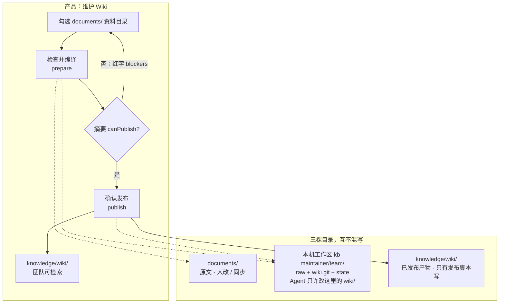
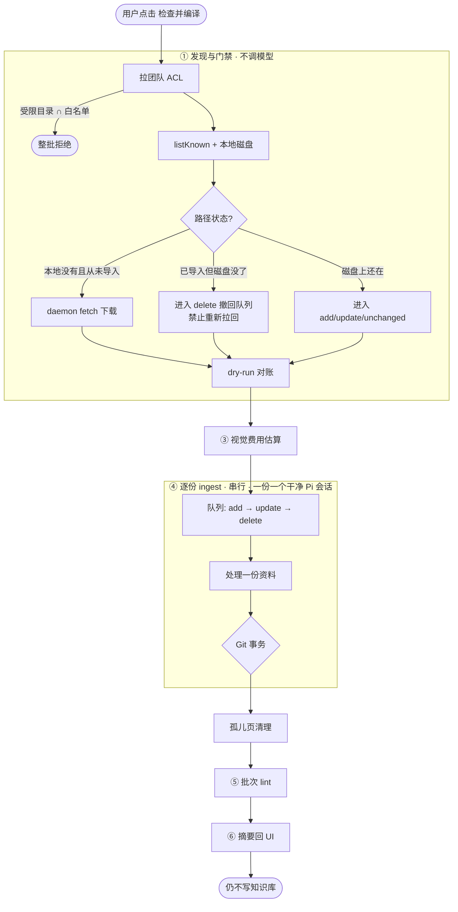
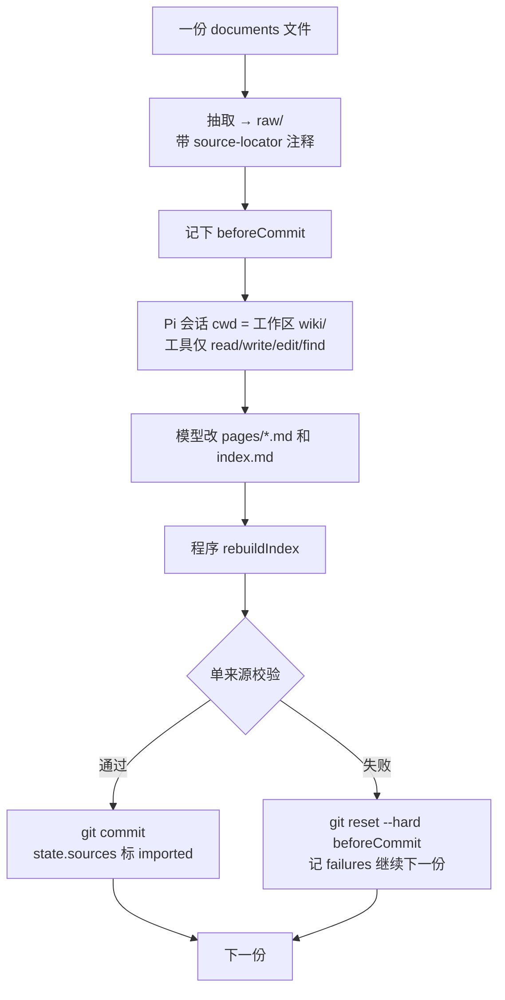
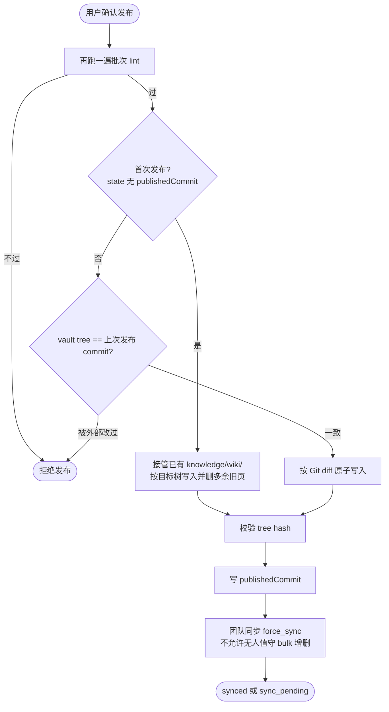
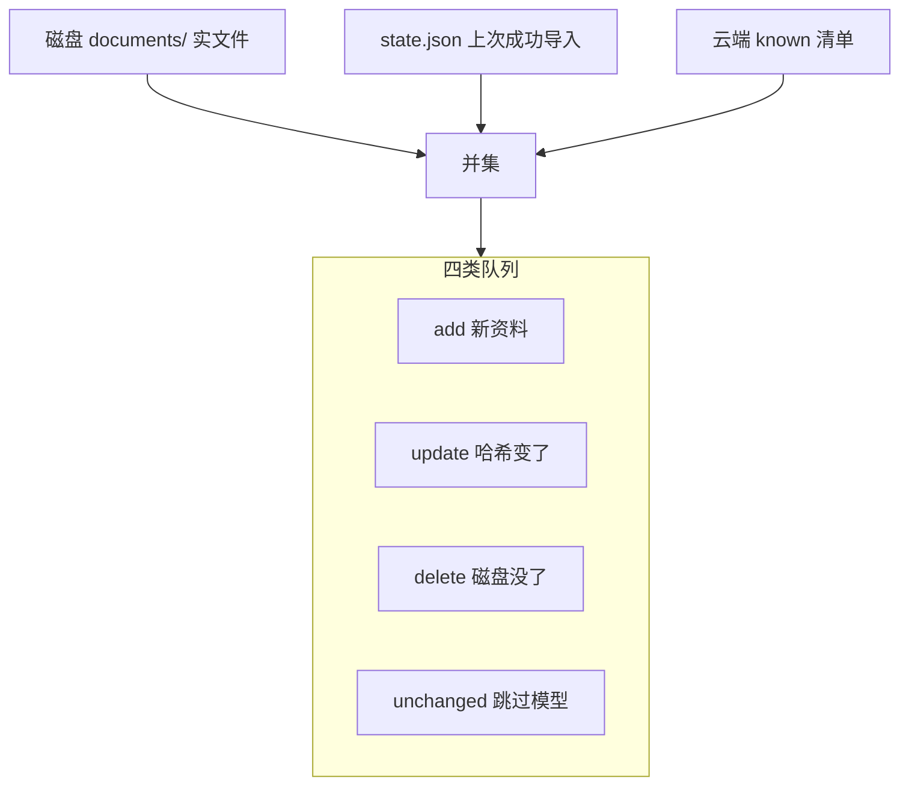

# kb-maintainer 流程

把团队 `documents/` 白名单中的原文，在本机沙箱编译成互相链接的 Wiki 页；只有通过确定性校验的批次，才会发布到 `knowledge/wiki/`。

人维护的 `knowledge/30-decisions/`、`40-runbooks/` 等目录完全不碰。

产品交互是两下：

1. **检查并编译**（prepare）— 只改本机工作区，不写知识库
2. **确认发布**（publish）— 通过校验后，才覆盖 `knowledge/wiki/`，再触发团队同步

设计原文见 [`docs/specs/2026-09-20-llm-wiki-maintainer-p0-design.md`](../../docs/specs/2026-09-20-llm-wiki-maintainer-p0-design.md)。想看**一份文件从原文变成知识库页面**的中间产物，读 [`WALKTHROUGH.md`](WALKTHROUGH.md)。

---

## 1. 总览



| 位置 | 角色 | 谁能写 |
| --- | --- | --- |
| `documents/` | 原文（删除资料就是删这里） | 人 / 团队同步 |
| 本机工作区 `kb-maintainer/<team>/` | 沙箱：`raw/` 抽取稿 + `wiki/` Git 库 + `state.json` | 维护器 + 编译 Agent |
| `knowledge/wiki/` | 已发布、全团队可检索的 Wiki | **只有发布脚本** |

桌面端工作区实际落在：

```text
~/Library/Application Support/teamclu/kb-maintainer/<team-id>/
├── raw/                 # 标准化原文，Agent 只读
├── wiki/                # 待发布 Wiki，本地 Git
├── state/state.json     # 增量状态
└── config.json          # 本次运行的白名单与节点 id
```

Agent **永远不直接写**知识库。编译在沙箱里完成，发布脚本才拷到 vault。

---

## 2. 「检查并编译」全链路



进度事件顺序：`plan` → `estimate` → `ingest`（带当前文件）→ `lint` → `done`。

---

## 3. 每一份资料的 Git 事务



Pi 只能用 read / write / edit / find，不能 bash，不能碰 `raw/`、`state/`、真正的知识库。程序不相信模型说「导入成功」，只看 Git diff + 校验结果。

模型约定：

1. 先读 `index.md`
2. 能更新已有主题页就更新
3. 没有等价页才新建
4. 页与页用 Wiki Link 连起来
5. 每个事实带来源路径、sha256、locator（能在 raw 里对上）

---

## 4. 单来源校验（失败就整笔丢掉）


实现入口：`scripts/kb-maintainer/validator.js` 的 `validateSourceDiff`。

---

## 5. 批次 lint 与发布

全部单来源事务完成后：

- 清掉「页还在、资料已删」的孤儿引用
- 全库死链、index 漏页/重复
- frontmatter 来源必须仍在当前 `state.sources`
- 确定性错误挡住发布；语义警告不挡



发布脚本是 `knowledge/wiki/` 的唯一写者。同步失败不会撤回本机已经发布的页面，但状态标为 `published_local_sync_pending`。

---

## 6. 对账队列



- **add / update**：抽取 + 调模型 + 单来源校验
- **delete**：按 `affectedPages` 撤回；页上还有其它有效来源则重编，否则删页
- **unchanged**：不调模型
- 已导入但磁盘缺失的路径，不得再被 known 清单复活成 download

---

## 7. 代码入口

| 步骤 | 入口 |
| --- | --- |
| UI 两下点击 | `packages/app/src/components/teamshare/WikiMaintainerRunSheet.tsx` |
| 前端 prepare / publish | `packages/app/src/lib/knowledge/wiki-maintainer-client.ts` |
| Tauri 编排、进度、网关 | `apps/desktop/src/commands/kb_maintainer.rs` |
| Node 编排 | `scripts/kb-maintainer/desktop-runner.js` |
| 对账 | `dry-run.js` + `reconcile.js` |
| 单来源事务 | `ingest.js` |
| Pi 编译 | `pi-runner.js` + `wiki-jail.js` |
| 单来源 / 批次校验 | `validator.js` / `lint.js` |
| 发布 | `publish.js` |
